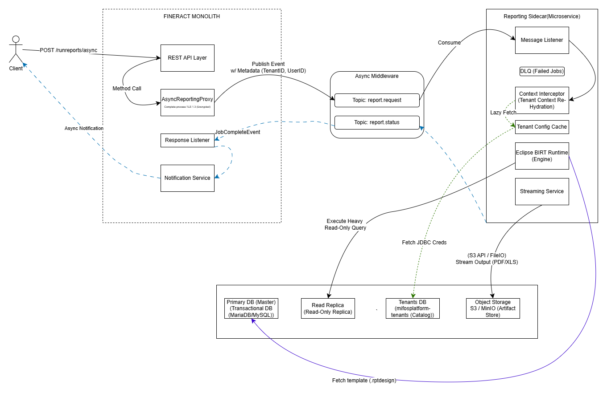

# Mifos X: Offloading Read-Heavy Workloads via CQRS & Reporting Sidecar

A performant, asynchronous reporting sidecar for **Mifos X**. Designed to physically decouple reporting workloads from the **Fineract Core** and modernize the stack using **Eclipse BIRT**.

---

## Table of Contents

* [Origin & Motivation](#origin--motivation)
* [Problem Identification & Analysis](#problem-identification--analysis)
* [Solution Architecture](#solution-architecture)
    * [High-Level Topology](#high-level-topology-hub-and-spoke)
    * [The Asynchronous Workflow](#the-asynchronous-workflow)
* [Core Components & Implementation Details](#core-components--implementation-details)
* [Key Design Trade-offs](#key-design-trade-offs)
* [Integration with Mifos Web App](#integration-with-mifos-web-app)
* [Strategic Importance to the Mifos Initiative](#strategic-importance-to-the-mifos-initiative)
* [Technical Stack](#technical-stack)
* [Expected Impact](#expected-impact)
* [Project Roadmap](#project-roadmap-duration-350-hours)
* [Resources & References](#resources--references)

---

## Origin & Motivation

It started with a simple question: **why do large deployments struggle with memory crashes during peak reporting cycles?**

To explore this, I spent time studying the Fineract repository, especially the `fineract-provider` codebase, reviewing the `MifosX` modules, and watching the talks on The ASF YouTube channel.

A clear explanation emerged from Frank Nkuyahaga’s breakdown of real-world production challenges <a href="#ref-1">[4]</a>. He described how high-volume deployments frequently encounter `OutOfMemoryError` crashes and severe slowdowns during End of Day processing. To stabilize production, they resorted to an expensive but effective workaround: **horizontal duplication**. They run three full-scale instances of the Fineract monolith, one for APIs, one for reporting, and one for scheduled jobs, purely to isolate traffic.

While this approach works, it is costly. The reporting instance still loads thousands of transactional classes it never uses, forcing organizations like MIFOS to provision large servers just to keep reporting from destabilizing the core platform.

While digging through the `mifos-reporting-plugin`, I came across a `TODO.md` file that hinted at a more elegant direction: **build standalone “service”, not just “plugin”**

It became clear that the maintainers had already recognized the limitations of embedding heavy reporting workloads inside the core runtime.

**This project is an attempt to realize that vision.** By extracting the reporting engine into a true sidecar service, it addresses the root causes of memory spikes and database locking, allowing reporting to scale independently without the overhead of running multiple full banking cores <a href="#ref-5">[5]</a>.

## Problem Identification & Analysis

Here is a breakdown of the five critical failure points I identified:

### 1. Synchronous Thread Blocking
While reviewing `RunreportsApiResource.java`, I noticed that the  [`processRequest`](https://github.com/apache/fineract/blob/develop/fineract-provider/src/main/java/org/apache/fineract/infrastructure/dataqueries/api/RunreportsApiResource.java) method operates synchronously. It forces the Tomcat web server thread to sit idle, waiting for the underlying service to return a `Response` object. There is no queuing or background hand-off.

This explains the "Service Unavailable" errors often reported by mobile wallet clients that Frank N. mentioned <a href="#ref-4">[4]</a>. If a General Ledger report takes 10 minutes to generate, that thread is effectively dead to the rest of the world for 10 minutes. If just 200 users run such reports simultaneously, the entire thread pool exhausts, and the API stops accepting new connections even for critical logins or transfers.

### 2. JVM Heap Contention 
The discovery was in [`PentahoReportingProcessServiceImpl.java`](https://github.com/openMF/mifos-reporting-plugin/blob/develop/src/main/java/org/apache/fineract/infrastructure/report/service/PentahoReportingProcessServiceImpl.java), in the `mifos-reporting-plugin`. The code initializes a `ByteArrayOutputStream` to capture the generated report, buffering the entire file in the Core JVM's Heap memory.

This confirms the production reality where large deployments face frequent "Stop-the-World" Garbage Collection pauses and sudden `OutOfMemoryError` crashes. Because the Reporting Engine and the Transactional Core share the same memory space, a single massive report doesn't just fail: it takes down the entire application, crashing the node for all users.

### 3. Connection Pool Starvation
Scaling the database layer is difficult because the reporting workloads draw connections from the exact same `HikariCP` pool used for real-time transactions. The code explicitly injects the `@Qualifier("hikariTenantDataSource")` into the reporting service, meaning there is no isolation.

In a high-traffic environment, analytical queries which often run for minutes can easily monopolize all available connections. This leads to the "Connection Timeouts" observed in production, where a Teller trying to disburse a loan gets rejected simply because the database pool is full of reporting queries.

### 4. Database Locking & Write Blocking
Perhaps the most subtle but damaging issue is how these queries interact with the database engine. I found that the reporting service obtains connections via a raw `dataSource.getConnection()` call without enforcing read-only semantics or `READ_UNCOMMITTED` isolation <a href="#ref-2">[2]</a>.

This means long-running analytical queries often acquire shared locks on critical transactional tables (like `m_loan` or `m_savings`). While the report scans these tables, Tellers cannot update them. The business literally freezes, unable to post repayments or approve loans until the report finishes reading the data.

### 5. Inefficient Scalability (Infrastructure Waste)
Currently, the only proven way to survive these issues is the pattern described in community talks: running three separate, full-scale instances of the Fineract monolith just to segregate traffic <a href="#ref-1">[1]</a>.

While effective, this is incredibly wasteful. It forces organizations to provision (and pay for) massive servers for the "Report Instance," which loads thousands of transactional classes it never uses. A decoupled Sidecar architecture would allow us to scale reporting capacity horizontally and cheaply, spinning up lightweight containers only during the End-of-Month rush without duplicating the entire banking core.

## Solution Architecture

To resolve the structural bottlenecks of heap exhaustion and connection pool starvation, this project proposes a transition from the current monolithic execution model to an **event-driven sidecar architecture**.

By physically decoupling the reporting logic into a dedicated microservice, the system separates resource-intensive “read” workloads (OLAP) from latency-sensitive “write” operations (OLTP). This aligns with the principles of **Command Query Responsibility Segregation (CQRS)** <a href="#ref-1">[1]</a>, ensuring that complex reporting jobs can no longer destabilize the core banking platform. Furthermore, we replace the legacy Pentaho dependency with **Eclipse BIRT**, aligning with modern open-source standards.

---

### High-Level Topology: Hub-and-Spoke

My idea is inspired from a **hub-and-spoke** topology:

* **The Hub (Fineract Core):** Acts as the command center, handling authentication, authorization, and all transactional logic.
* **The Spoke (Reporting Sidecar):** An isolated compute engine dedicated solely to report execution using the **BIRT Runtime**.
* **The Channel (Async Middleware):** A durable message broker (ActiveMQ / Kafka) that buffers requests and absorbs traffic spikes without overwhelming the reporting engine.

---

### The Asynchronous Workflow

1. **Request Ingestion (Fire-and-Forget)**
   When a user triggers a report via the web application, the Fineract Core validates permissions and request parameters. It immediately publishes a `ReportRequestEvent` to the **Request Topic**.
   The API responds with `HTTP 202 Accepted` along with a Job ID, releasing the web server thread within milliseconds.

2. **Secure Context Propagation**
   The multi-tenant context across asynchronous boundaries should not be lost, so the Core injects **tenant identity** (e.g., `tenant_id=bank_a`) and **user context** into message metadata.

3. **Isolated Execution (The Sidecar)**
   The Reporting Sidecar consumes the event. Before execution begins, a **Context Interceptor** reads the message metadata and rehydrates the internal security and tenant context. A **tenant configuration cache** is then used to resolve the correct database credentials for that tenant.

4. **Read-Replica Routing**
   The Sidecar connects to the database using a **dynamic routing `DataSource`**. If the tenant is configured with a read replica, all heavy analytical queries are routed there, ensuring that the primary transactional database remains unaffected.

5. **Streaming & Persistence**
The **Eclipse BIRT Engine** renders the report (`.rptdesign` template). Instead of buffering the entire output in memory, the result is **streamed directly** to object storage (S3 / MinIO). This keeps memory usage constant regardless of report size.

6. **Completion Loop**
   Once the report artifact is securely stored, the Sidecar publishes a `JobCompleteEvent` to the **Response Topic**. A listener within the Fineract Core consumes this event and notifies the user (via the notification service) that the report is ready for download.

---

## Core Components & Implementation Details

### 1. Async Reporting Proxy (Fineract Core)

A new component, `AsyncReportingProxy`, will be introduced within the monolith. It acts as the bridge between the synchronous HTTP API and the asynchronous reporting pipeline. The proxy serializes the request and wraps it in a **CloudEvents-compliant envelope**, embedding essential metadata such as trace ID, tenant ID, and authenticated principal.

---

### 2. Reporting Sidecar (Microservice)

The Reporting Sidecar is a standalone Spring Boot 3.x application optimized for compute-heavy workloads. It enforces isolation through the following mechanisms:

* **Context-Aware Listener:** A custom `JmsListener` or `KafkaListener` combined with an AOP-based interceptor sets up the `ThreadLocal` tenant and security context before business logic execution.
* **Lazy-Loaded Configuration:** Tenant database credentials are not stored locally. Instead, the Sidecar periodically fetches connection details from the centralized `mifosplatform-tenants` catalog.
* **Throughput Control:** Backpressure is enforced by limiting concurrent consumers. For example, if 500 reports are queued, the Sidecar may process only 5 concurrently (configurable), preventing CPU and memory saturation.

---

### 3. Data Isolation

To guarantee that reporting workloads never block transactional operations, the Sidecar applies a tiered database access strategy:

* **Tier 1 (High-Scale):**
  If a `ro_url` (read-only endpoint) is configured for a tenant, the Sidecar connects exclusively to the **read replica**, providing complete physical isolation.

* **Tier 2 (Standard Deployments):**
  If only a primary database is available, the Sidecar connects to it but enforces `TransactionIsolation.READ_UNCOMMITTED` on the JDBC connection <a href="#ref-2">[2]</a>. This allows non-blocking reads by ignoring row-level locks held by active transactions, preventing reports from delaying teller operations.

## Key Design Trade-offs

This section outlines the key design choices I made for the Reporting Connector, and the rationale behind each.

---

### 1. In-Process Asynchrony vs. Physical Process Isolation

We could have retained reporting within the monolithic JVM and introduced asynchronous execution using Spring’s `@Async` support. This approach would reduce deployment complexity by avoiding an additional service. However, while `@Async` prevents request-thread blocking, it does not address JVM-level resource contention. A large report executing asynchronously within the same JVM can still exhaust heap memory, trigger prolonged garbage collection pauses, or cause an `OutOfMemoryError`, ultimately crashing the entire application.

Separating report execution into an independent process ensures that failures or resource spikes in reporting **cannot propagate** to the transactional core. The added operational overhead of managing a second service is a necessary and justified cost to guarantee core banking availability.

Hence, we adopt **physical process isolation** by executing reporting workloads in a separate runtime.

---

### 2. Domain API Access vs. Direct Database Reads

Microservice best practices discourage shared database access and recommend inter-service communication through well-defined APIs <a href="#ref-3">[3]</a>. However, reporting is fundamentally a bulk-read, analytical workload rather than a domain-logic operation. Generating reports that scan millions of records via REST APIs would introduce prohibitive overhead due to network latency, object hydration, and serialization costs.

Therefore, we allow the reporting service to **connect directly to tenant databases** for read-only access, as direct JDBC-based access is the only practical approach to achieve the throughput required for regulatory and end-of-day reports within acceptable time windows, while still preserving transactional integrity by limiting access to read-only queries.

---

### 3. Strict Consistency vs. System Availability

Financial reporting demands accuracy, and strict consistency can be achieved by enforcing strong transactional locks during reads <a href="#ref-2">[2]</a>. However, in high-volume Digital Financial Services (DFS) environments, blocking live transactions in order to generate reports is operationally unacceptable. By leveraging read replicas where available, or relaxed isolation levels such as `READ_UNCOMMITTED`, the system accepts minimal temporal inconsistency (for example, missing a transaction committed milliseconds earlier).

This trade-off ensures that reporting workloads never acquire locks that block critical transactional tables, preserving uninterrupted teller and customer operations.

Hence, we prioritize **availability over strict consistency** during peak operational hours.

---

### 4. Immediate Response vs. Asynchronous User Interaction

While users are accustomed to synchronous workflows where clicking “Run Report” immediately returns a PDF or spreadsheet, the synchronous interaction model fails under real-world conditions. Mobile clients, load balancers, and API gateways commonly enforce 30–60 second timeouts, making long-running report generation inherently unreliable.

By returning `HTTP 202 Accepted` immediately and executing the report asynchronously, the system decouples request handling from execution. This guarantees API responsiveness regardless of report complexity, while allowing clients to poll for status or receive notifications upon completion.

Hence, we adopt an **asynchronous request–reply pattern** for report execution.

---

### Summary

Collectively, these choices enable a reporting architecture that scales independently, avoids contention with transactional workloads, and remains resilient under peak operational load while preserving compatibility with existing Fineract reporting requirements.

## Integration with Mifos Web App

To support our new model, the frontend integration targets the [`web-app`](https://github.com/openMF/web-app) repository, [reports](https://github.com/openMF/web-app/tree/dev/src/app/reports) folder. This project will also involve refactoring the synchronous `Blob` handling into a reactive polling pattern.

### 1. Asynchronous Service Layer (`src/app/reports/reports.service.ts`)
* **Current State:** The `getPentahoRunReportData` method [Line 105] enforces a blocking HTTP call with `responseType: 'arraybuffer'`, causing browser timeouts on large reports.
* **Refactoring:**
    * Introduce `initiateAsyncReport(name, params)`: Sends a `POST` request and expects `HTTP 202` + `Job-ID`.
    * Introduce `pollReportStatus(jobId)`: A lightweight endpoint to check completion status. 

### 2. Run Report Controller (`src/app/reports/run-report/run-report.component.ts`)
* **Current State:** The `run()` method [Line 356] simply instantiates the legacy `PentahoComponent`, which triggers the blocking download immediately.
* **Refactoring Plan:**
    * Modify `run()` to bypass the legacy `hidePentaho` toggle.
    * Implement a **Reactive Polling Stream** using RxJS `timer(0, 5000)` and `switchMap` to track the job status.
    * **User Feedback:** Replace the loading spinner with a non-blocking toast notification using the existing `AlertService` [Line 408]: *"Report processing started. You will be notified when ready."*

### 3. Notification & Download Center
* **New Logic:** When the polling service returns `status: COMPLETED`, the UI will present a **"Download Ready"** action in the Notification Tray [(`src/app/notifications/`)](https://github.com/openMF/web-app/tree/dev/src/app/notifications), allowing the user to fetch the file from the secure Sidecar URL (MinIO) rather than the Fineract Core.

## Strategic Importance to the Mifos Initiative

This project addresses a critical stability gap in the Fineract ecosystem and organisations using them, directly supporting our foundation's mission to provide robust financial infrastructure for the unbanked.

### 1. Protecting the "Mobile-First" Experience
In many emerging markets, Mifos is accessed primarily via mobile wallets and field officer apps over unstable 3G/4G networks. These clients are extremely sensitive to latency. A "Service Unavailable" error during a loan collection isn't just a technical glitch; it is a breakdown of trust between the bank and the client.
By moving the heavy reporting workload off the main thread, we ensure that the **Core API remains responsive 100% of the time**. This guarantees that a back-office audit never blocks a field transaction, preserving the reliability required for digital financial services.

### 2. Democratizing Infrastructure (Lowering TCO)
Currently, smaller MFIs (Microfinance Institutions) are forced to provision expensive, high-memory servers to safeguard against crashes during End-of-Month reporting spikes. This high "entry cost" creates a barrier to adoption.
The Sidecar architecture enables **Elastic Scaling**. Providers can run a lean, low-cost Core server and only spin up temporary, lightweight reporting containers when needed. This significantly lowers the Total Cost of Ownership (TCO), making professional core banking accessible to smaller institutions with limited IT budgets.

### 3. A Blueprint for Modularization
The Fineract community has long discussed the need to decompose the monolith <a href="#ref-5">[5]</a>. This project serves as a **canonical reference implementation** for extracting a major functional domain into a microservice without breaking legacy compatibility. It establishes the patterns: Event Envelopes, Context Propagation, and Shared Database contracts that future contributors can use to modularize other heavy components (like Interest Posting or Notification generation).

## Technical Stack

The architecture leverages a modern, cloud-native stack that is fully aligned with current **Apache Fineract** standards and ecosystem conventions.

---

### Core Runtime & Framework
* **Language:** Java 25 (LTS)
* **Framework:** Spring Boot >= 4.0.1
* **Build Tool:** Gradle (Composite builds for strict module separation)
* **Containerization:** Docker (multi-stage builds)

---

### Asynchronous Messaging & Integration
* **Message Broker:** Apache ActiveMQ 6.x (default) / Apache Kafka (enterprise option)
  *Kafka is kept as an option for high-throughput deployments. ActiveMQ remains the default for now, and the final choice would depend on real production volume and feedback from the maintainers.*
* **Transport Security:** * **TLS 1.3** enforced for all ActiveMQ connections.
* **Resilience:** Resilience4j (Circuit breakers applied to database connectors)

---

### Data Access & Persistence
* **Connection Pooling:** HikariCP (Configured with leak detection enabled)
* **Routing:** Spring `AbstractRoutingDataSource` (Dynamic multi-tenant context switching)
* **Object Storage:** MinIO Client (S3-compatible) for streaming report artifacts
* **Database:** MariaDB >= 11.5.2 (default) / PostgreSQL >= 17.0

---

### Reporting Engine
* **Engine Core:** **Eclipse BIRT Runtime**
* **Templating:** `.rptdesign` (BIRT Report Designer) compatibility.
* **Output Formats:** PDF , Excel (Apache POI), CSV

---

### Observability & Quality Assurance (Still exploring this)
* **Tracing:** OpenTelemetry (Propagates `traceId` from Core to Sidecar)
* **Metrics:** Micrometer / Prometheus (JVM memory, queue depth, latency)
* **Testing:** Testcontainers (Integration tests with real MySQL/ActiveMQ instances)

## Expected Impact

Once deployed, the proposed architecture is expected to deliver clear, measurable improvements compared to the current monolithic setup.

| Metric | Current State (Monolith) | Proposed State (Decoupled Reporting Service) |
| :--- | :--- | :--- |
| **API Availability** | **Unstable** - request threads remain blocked during report generation. | **Highly Available** - requests are handed off asynchronously. |
| **Fault Isolation** | **None** - an OOM during reporting can crash the entire application. | **Strong** - reporting failures do not affect the transactional core. |
| **Write Latency** | **Variable** - long-running reads contend with transactional writes. | **Consistent** - read replicas or relaxed isolation prevent write blocking. |
| **Throughput** | **Limited** - constrained by vertical scaling of the monolith. | **Elastic** - reporting workers can scale independently based on queue depth. |
| **Memory Footprint** | **Spiky** - large in-memory buffers cause sudden heap pressure. | **Predictable** - streaming I/O keeps memory usage stable. |

## Project Roadmap (Duration: 350 hours)

### Phase 1: The Async Foundation (Weeks 1–4)

**Goal:** Decouple the Core API from execution logic.

* **Scaffolding & API Contract:** Initialize the `fineract-reporting-connector` microservice and define a non-blocking `POST /v1/runreports/async` endpoint in the Core.
* **Event Producer (Core):** Implement `AsyncReportingProcessService` to serialize requests and publish `ReportRequestEvent`s to the message broker (ActiveMQ).
* **Event Consumer (Sidecar):** Implement the listener infrastructure to consume messages and extract `Tenant-ID` and security headers.
* **Milestone:** A verified end-to-end flow where an API call in the Core triggers a corresponding log event in the reporting service via the queue.

---

### Phase 2: The Engine & Data Access (Weeks 5–8)

**Goal:** Enable the reporting service to securely access tenant data and render reports.

* **BIRT Integration:** Integrate the **Eclipse BIRT Runtime** libraries and configure the headless execution environment within the Spring Boot 4 context.
* **Dynamic Multi-Tenancy:** Implement `AbstractRoutingDataSource` along with a credential resolution mechanism to dynamically route queries to the correct tenant database based on event metadata.
* **Streaming Pipeline:** Replace the legacy in-memory buffering approach with a `PipedInputStream`-based pipeline to stream generated artifacts directly to S3 / MinIO.
* **Milestone:** Successful generation of a real PDF report using live data from a specific tenant database.

---

### Phase 3: Hardening & Production Readiness (Weeks 9–12)

**Goal:** Reliability, observability, and handover.

* **Resilience Layer:** Implement Dead Letter Queues (DLQ) for failed jobs and circuit breakers around database connections.
* **Isolation Logic:** Finalize the read-replica detection strategy and the `READ_UNCOMMITTED` fallback for single-node deployments.
* **Validation:** Integrate Micrometer metrics (queue depth, processing time) and perform load testing (JMeter) to validate blast-radius containment.
* **Milestone:** Final pull request submission with comprehensive deployment documentation and migration guidance.

## Resources & References

**Architecture & Patterns**
1.  **Richardson, C.** (2018). *Microservices Patterns: With examples in Java*. Manning Publications. (See: "Database per Service" vs. "CQRS").
2.  **Kleppmann, M.** (2017). *Designing Data-Intensive Applications*. O'Reilly Media. (Chapter 7: Transactions & Isolation Levels).
3.  **Newman, S.** (2015). *Building Microservices*. O'Reilly Media. (Chapter 4: Integration - "Reporting").

**Youtube Videos(The ASF)**

4.  **Nkuyahaga, F.** (2024). *Expanding Fineract Capabilities*. Apache Fineract Community Talk. (Detailed analysis of production scaling limits).
5.  **Vidakovic, A.** (2024). *Modularization of Fineract*. (Discusses the need for decoupling monolithic dependencies).# mifos-reporting-connector
